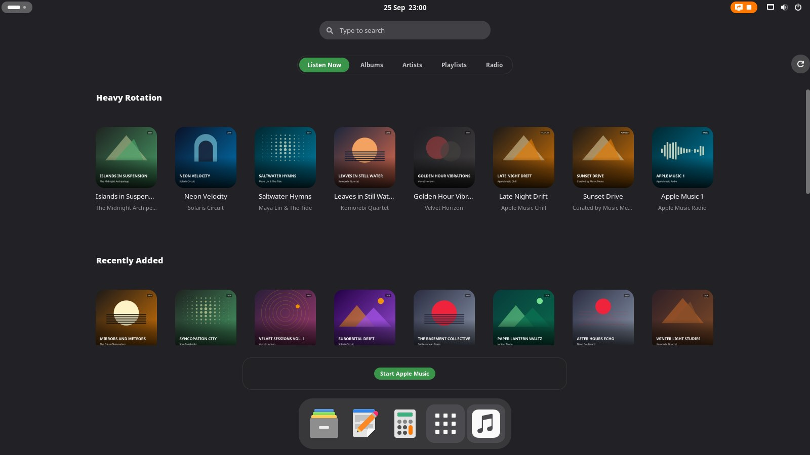

# Music Menu

> **Work in progress.** This is an early, unfinished extension that I'm
> building for my own desktop. It runs, signs in, syncs a library and plays
> music, but expect rough edges, missing pieces and breaking changes between
> commits. It is not on extensions.gnome.org and there is no release yet.
> Issues and ideas are welcome; just don't rely on it.

Your Apple Music library as a menu in GNOME, beside Show Apps: Listen Now,
Albums, Artists, Playlists and Radio, with a player bar and a full Now Playing
view. No paid app, no developer account — it drives Apple's own web player.



<sub>Screenshot from the made-up demo library, not a real account.</sub>

- **Listen Now.** A vertical list of shelves — Heavy Rotation, Recently
  Added, Recently Played, Made for You — each a horizontal row of tiles.
- **Albums, Artists, Playlists, Radio.** Square covers, round artist lockups,
  the same tabs and grid GNOME's own app folders use. Pick one and its pane
  pops up: art, title, artist, genre, year, Play/Shuffle, and its track list.
- **A player bar** under the grid shows what's playing, with transport
  controls and a scrubber. Open it into a full **Now Playing** view — big
  art, lyrics, and the Up Next queue.
- **Search from the overview.** Type in GNOME's own search and Apple Music's
  catalogue and your library answer alongside your apps. With the menu
  open, the same search is Apple Music's alone: only its results show.
- **Right-click actions.** Play Next, Play Later, love/unlove, add to library
  or a playlist, copy link — on a tile or a track row.
- **Remote or controller.** Map a TV remote's keys or a game controller's
  buttons and browse from the sofa, the same as its sibling extensions.
- **Four places to open.** In the overview, in a pop-up panel, on the
  desktop, or on a workspace of its own.

## How it actually works

There's no paid API token and no third-party client. Music Menu starts
**Google Chrome** in a profile of its own, signed in to music.apple.com like
any browser tab, with Chrome's DevTools protocol turned on. It drives Apple's
own **MusicKit** web player through that connection — the same object the
music.apple.com page itself uses to search, queue and play. The shell process
never touches the network directly; a small Python program (`am.py`) does
that over DevTools and hands the shell plain JSON files.

Two things follow from that:

- **Apple could change the web player** and break this. It isn't a
  supported API, just the one the browser already has.
- **Audio quality is whatever the web player streams** — 256 kbps AAC, not
  the lossless or Dolby Atmos tiers Apple's native apps can reach.

## What stays on your machine

Nothing about your account is in this repository, and nothing leaves your
computer except the requests Chrome itself makes to Apple.

- **Your Apple ID session** lives in Chrome's own profile under
  `~/.local/share/music-menu/chrome`, exactly as a browser login does. Music
  Menu never sees a password, a cookie or a token; it asks the page's own
  player to do things.
- **Your library** is cached as `~/.cache/music-menu/library.json` with its
  artwork alongside. Delete that folder and the profile above to wipe every
  trace.
- **The DevTools port** Chrome listens on is bound to localhost only.

The test fixtures and the demo library in `scripts/demo_library.py` are
made-up data, not anyone's real collection.

## Requirements

- GNOME Shell 48, 49 or 50.
- Python 3 with PyGObject (`python3-gi` — most GNOME desktops already have
  it; nothing else is installed with pip).
- **Google Chrome** (`google-chrome-stable`), the real Google build, not
  Chromium — it needs Widevine, which Chromium doesn't ship.
- An **Apple Music subscription**. No developer account, no paid app.

## Install

```bash
git clone https://github.com/Jackicus/GNOME-Music-Menu.git
cd GNOME-Music-Menu
make install
```

Log out and back in. GNOME only picks up a new extension when you log in.

## First run

Open the preferences (`gnome-extensions prefs music-menu@jackt`), go to
**Apple Music**, and press **Sign In**. That opens a visible Chrome window at
music.apple.com — sign in with your Apple ID there, the same as on any
computer. Close it, come back to the preferences, and press **Sync**. That
pulls your library into a local cache and downloads artwork; after that
Chrome can run headless in the background.

## Where it opens

The **General** page chooses where the library opens and where a picked
album, playlist or artist opens. The two settings are separate, so you can
mix them.

| | The library | A picked item |
|---|---|---|
| **Menu** | In the overview, beside your apps | Pops up the way an app folder does |
| **Modal** | In a panel over the desktop | In a panel over everything |
| **Desktop** | On the wallpaper of the workspace you're on | In place of the grid |
| **Workspaces** | On a workspace of its own | On a workspace of its own |

## Troubleshooting

`make logs` shows what went wrong in the shell. For the Apple Music side —
whether the engine is running, whether it's signed in, what storefront and
bitrate it's using — run:

```bash
python3 src/backend/am.py status
```

## Development

```bash
make link      # install as a link to src/, for development
make reload    # apply your edits to the running shell, no logout needed
make nested    # start a throwaway nested GNOME Shell, mirrored in a window
./scripts/check.sh   # JS syntax, schema, Python syntax and the backend's unit tests
```

`CLAUDE.md` explains how it's built. [`docs/`](docs/) covers the shell
internals it depends on, compatibility, and publishing.

---

<sub>Music Menu is built as a copy of
[GNOME-Video-Menu](https://github.com/Jackicus/GNOME-Video-Menu), the sibling
extension for TV shows and films, with its UI mechanics reused and its
back end replaced entirely.</sub>
